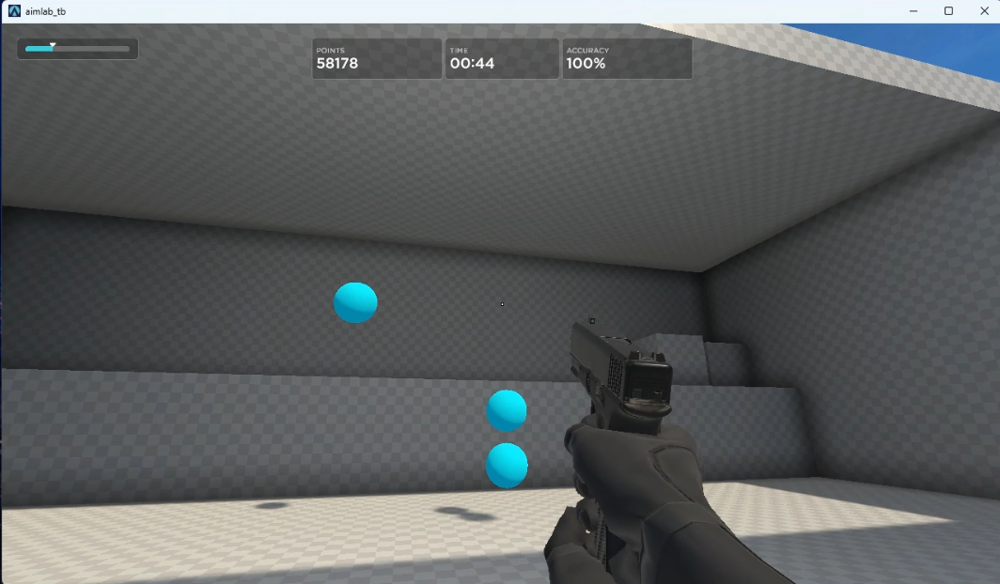

# 🎯 Aim Lab Gridshot Automation with OpenCV

[](README_CN.md)

A computer vision experiment that automates target acquisition in **Aim Lab Gridshot** mode. This project demonstrates real-time object detection, path optimization, and precise mouse control using Python and OpenCV.




## ✨ Features

- **HSV Color Detection** - Detects blue target orbs using HSV color space filtering
- **TSP-Based Path Optimization** - Solves a mini Traveling Salesman Problem to determine the shortest route through visible targets
- **Ghost Filtering** - Prevents re-targeting recently hit orbs during their fade-out animation
- **Window Handle Capture** - Uses `dxcam` + `win32gui` for fast, accurate screen capture
- **Open-Loop Control** - Precise cursor movement with sensitivity calibration

## 🧠 How It Works

### Target Detection
The CV pipeline converts each frame to HSV color space and applies a color mask to isolate the cyan target orbs. Contour detection extracts candidate regions, filtered by area and aspect ratio to reject noise.

### Path Planning (TSP)
With up to 3 targets visible at once, the script solves a mini **Traveling Salesman Problem** using brute-force permutation (feasible for N≤4). Starting from the current cursor position, it evaluates all possible visit orders and selects the path with minimum total Euclidean distance. This ensures optimal target ordering for maximum speed.

### Mouse Control
The controller uses raw Win32 `mouse_event` calls for low-latency cursor movement. Path interpolation breaks large movements into smaller steps to maintain accuracy at high DPI settings.

## 🏗️ Architecture

```
main.py              Main loop (open-loop control)
├── capture.py       Window handle capture (dxcam + win32gui)
├── vision.py        HSV color detection pipeline
├── tracker.py       Multi-target tracker (optional)
├── controller.py    Mouse control (ctypes raw input)
└── config.py        Configuration parameters
```

## 🚀 Quick Start

### Prerequisites

- Windows 10/11
- Python 3.13+
- [UV](https://docs.astral.sh/uv/) (recommended) or pip
- Aim Lab (Steam)

### Installation

```bash
# Clone the repository
git clone https://github.com/ruali-dev/aimlab-gridshot-with-opencv-python.git
cd aimlab-gridshot-with-opencv-python

# Install dependencies with UV
uv sync

# Or with pip
pip install -e .
```

### Calibration

Before first use, calibrate your ROI offset:

```bash
uv run tools/roi_calibrator.py
```

1. Open Aim Lab and enter Gridshot mode
2. Adjust offsets with `I/K/J/L` keys until the green crosshair aligns with your game crosshair
3. Press `P` to print values, then update `config.py`

### Running

```bash
uv run main.py
```

- Press `F4` to toggle the automation ON/OFF
- The script runs in the background while you play Gridshot

## ⚙️ Configuration

Edit `config.py` to tune parameters:

| Parameter | Description | Default |
|-----------|-------------|---------|
| `ROI_WIDTH/HEIGHT` | Capture region size | 800×640 |
| `SENSITIVITY_MULT` | Mouse sensitivity multiplier | 2.89 |
| `BALL_COLOR_LOWER/UPPER` | HSV color range for targets | Cyan |
| `GHOST_TIME` | Ignore recently hit targets (ms) | 80 |

## 🛠️ Tools

| Tool | Description |
|------|-------------|
| `tools/roi_calibrator.py` | Calibrate ROI offset alignment |
| `tools/auto_sensitivity_calibrator.py` | Auto-calibrate mouse sensitivity |

## ⚠️ Disclaimer

This project is for **educational and research purposes only**. It serves as a demonstration of computer vision techniques and should not be used to gain unfair advantages in competitive scenarios. Use of automation tools may violate Aim Lab's Terms of Service. Use responsibly and at your own risk.

## 📄 License

MIT License - See [LICENSE](LICENSE) for details.
